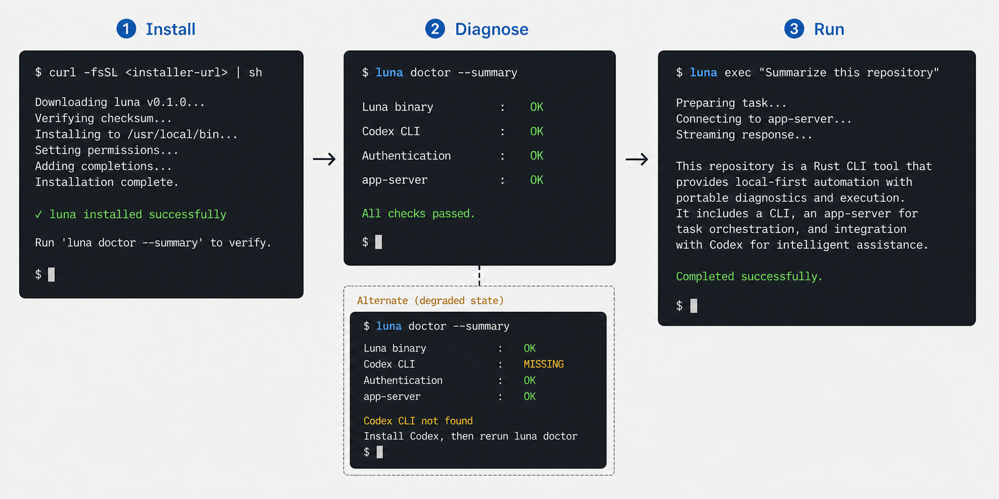
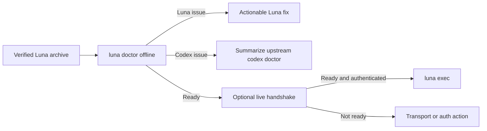

# Portable first run

> Let a developer install Luna on a supported machine and reach either a successful first turn or an actionable diagnosis without cloning the repository or installing Rust.

**Research snapshot:** 2026-08-02 
**Decision status:** implemented on 2026-08-02; fresh-environment value experiment not yet run

**Implementation:** the Luna CLI now provides versioned offline/live doctor reports, stable error categories, OS-neutral Codex discovery, explicit WebSocket ownership, portable temp/log handling, declarative help/completions, a checksum-verifying version-pinned installer, and an attested release workflow. See the [Luna README](../../README.md) for the shipped contract. Package-manager expansion, self-update, Windows release assets, and the proposed 5–8-environment value experiment remain gated by the original evidence criteria rather than being treated as automatically approved scope.

## Decision

Make Luna a **portable, self-describing binary** before adding another agent feature. Publish checksummed release binaries and platform installers, remove OS-specific launcher assumptions, and add a Luna-scoped `doctor` command that composes—rather than reimplements—the upstream Codex diagnostic surface.

The target user is a developer who wants Luna's opinionated one-shot app-server flow on a new workstation, CI runner, or teammate's machine. The outcome is binary: a supported install reaches a successful no-op/first-turn smoke flow, or Luna stops before model work with a redacted report and one actionable next step.

This proposal does **not** claim that demand for Luna is established. It claims that source-only installation and ambiguous dependency failures prevent demand from being measured cleanly.

## Value proposition

### User job

Today an external user must infer the repository location, clone it, install a Rust toolchain, build from source, put `$HOME/.local/bin` on `PATH`, separately install/authenticate Codex, and diagnose transport/config problems across two programs. The documented install recipe is repository-local `cargo install --path`; it is not an end-user distribution path.

The user's actual job is smaller: “put `luna` on this machine, confirm its upstream dependency is compatible, and run one command from my project.”

### Outcome

- A fresh supported machine installs Luna without a Rust toolchain or repository checkout.
- The installer verifies the downloaded archive and reports exactly where the binary was placed.
- `luna doctor --summary` distinguishes Luna, Codex CLI, authentication, configuration, transport, and filesystem failures.
- `luna doctor --json` emits a versioned, redacted report suitable for CI artifacts and issue reports.
- Unsupported platforms and versions fail honestly before a turn starts; installers never silently install or authenticate Codex.
- Maintainers can reproduce release builds and test platform promises in CI rather than inferring portability from Rust source compatibility.

### Product-specific leverage

Luna already owns the exact seams needed for a useful preflight:

- it resolves the Codex executable and Codex home;
- it selects stdio versus managed/unmanaged WebSocket transport;
- it performs the app-server handshake and account read;
- it constructs typed `ThreadOptions` and `TurnOptions`; and
- it already has text, final-response, and JSONL output modes.

An upstream `codex doctor` can report Codex health, but it cannot explain Luna's selected transport, daemon behavior, resolved model/reasoning defaults, or Luna build provenance. Luna should add only that delta, embedding or summarizing the upstream redacted report when the installed Codex version supports it.

## Metric frame and baseline

The proposal uses three lenses. These are product metrics for the experiment, not claims about current users.

| Lens | Definition | Repository baseline on 2026-08-02 | Desired signal |
|---|---|---|---|
| UX | Time and ambiguity from install intent to first successful command or actionable failure | README documents source execution/install; help presents 37 option rows; unauthenticated preflight can return success and fail later | Median fresh-machine setup completes without repository help; every injected prerequisite failure names the failed layer and next action |
| DX | Cost to extend, test, release, and consume Luna as a command contract | One 3,355-line production source file; 55 embedded unit tests and 3 live integration tests; no workflow files or releases | Release is tag-driven and reproducible; parser/help/completions share one definition; preflight and output contracts have offline tests |
| Portability | Number of hidden OS/toolchain assumptions between download and execution | Clone + Rust required; `which codex`; fixed SDK `/tmp` logs; Unix-only daemon lifecycle branches; no verified target matrix | Each advertised target has an install asset, no-network smoke test, path/temp test, and documented upstream limitation |

The baseline commands were `wc -l`, test-attribute counts, help-row counts, workflow/release inventory, and `cargo publish --dry-run -p luna --allow-dirty`. The publish dry run failed because the path dependency on `codex-app-server-sdk` has no version requirement; it also reported that the crates.io name `luna` is already occupied. This makes GitHub release binaries the least-coupled first distribution experiment.

## Scientific-method ideation

### Observation and question

Luna is feature-rich enough to expose 37 documented option rows, sessions, resumption, two transports, agent profiles, structured output, and dynamic tools. Yet it has no end-user release, no CI workflow, and several platform-sensitive process/filesystem choices. Meanwhile, current Codex already offers installation, completions, diagnostics, session picking, configuration profiles, and non-interactive JSONL execution.

The question is therefore not “what feature can Luna copy next?” It is:

> Which change makes Luna easier to try, automate, and move between machines while preserving a reason to exist beside `codex exec`?

### Competing hypotheses

| Hypothesis | Why plausible | Strongest challenge | Verdict |
|---|---|---|---|
| Portable release + Luna-scoped preflight | Removes a measured distribution barrier and makes platform claims testable | Generic release engineering; unnecessary if Luna is only an in-repo tool | **Advance** as the smallest prerequisite to measuring real use |
| Version-controlled `.luna.toml` named tasks | Replaces long flag bundles with discoverable team workflows | `just`, Task, shell scripts, and Codex project config already cover much of the job | **Defer** until installation and repeat-use evidence exist |
| Stable JSON result envelope + exit taxonomy | Improves CI and wrapper integration | Luna already has JSONL; upstream Codex and Gemini already expose machine modes | **Narrow** into the portability hardening phase, not a standalone product thesis |
| Interactive session picker/TUI | Improves resume discovery | Upstream Codex already has a session picker; Luna's differentiation is one-shot execution | **Reject** |
| Full parity with `codex exec` flags and subcommands | Reduces migration friction | Permanent catch-up treadmill with a mature upstream CLI and no differentiated outcome | **Reject** |
| Refactor to `clap` and shared CLI modules | Cuts parser drift, generates help/completions, and improves testability | Internal quality alone does not create a user outcome | **Keep as an enabler**, bounded by the first-run contract |
| Bundle the Codex CLI/app-server inside Luna | Appears to create a single artifact | Couples security/update cadence, auth, licensing, and lifecycle; obscures the real dependency | **Reject** |

### Iteration log

#### Iteration 1: portable task manifest

**Hypothesis:** a `.luna.toml` task manifest would make complex agent runs reusable across developers and CI. 
**Attempted falsification:** compare it with current Codex profiles/project config and cross-platform task runners. 
**Evidence:** Codex already supports project-scoped configuration and user profiles; `just` and Task already provide project command discovery across operating systems. Luna has no issue or usage evidence showing repeated flag bundles. 
**Verdict:** defer. A manifest could become valuable later, but building it now would add a second configuration system before Luna is straightforward to install.

#### Iteration 2: richer sessions UI

**Hypothesis:** a picker would make continuation much easier than copying IDs from tabular output. 
**Attempted falsification:** inspect upstream session behavior and Luna's intended one-shot role. 
**Evidence:** current Codex supports interactive resume/fork pickers and `exec resume`; Luna already offers `sessions`, `--continue`, and `--resume`. 
**Verdict:** reject as commoditized and off-positioning.

#### Iteration 3: stable automation contract

**Hypothesis:** a versioned result envelope and exit taxonomy would make Luna a better CI primitive. 
**Attempted falsification:** compare current Luna and upstream machine modes. 
**Evidence:** Luna has JSONL and final-response modes, while current Codex exposes JSONL, an output-last-message file, and structured output; Gemini documents specific fatal exit codes. Luna does still have unpinned JSON rendering and one catch-all failure exit. 
**Verdict:** narrow to a required hardening layer of a portable release. It is important but not sufficiently differentiated alone.

#### Iteration 4: portable, self-describing release

**Hypothesis:** verified binaries plus a composed preflight will turn installation/configuration failures into a measurable funnel. 
**Attempted falsification:** test whether source install is already adequate and whether upstream diagnostics make Luna diagnostics redundant. 
**Evidence:** there are no releases or workflows; the documented installer works only from a clone; crates.io publishing is not currently viable; source inspection finds `which`, `/tmp`, and incomplete non-Unix daemon semantics. Upstream `codex doctor --json` covers Codex but not Luna's resolution and transport choices. 
**Verdict:** advance, narrowed to distribution plus Luna-specific delta checks. Do not rebuild upstream diagnostics.

### Strongest null hypothesis

**Null:** Luna is an experimental, developer-owned wrapper in a Rust workspace. Its target users already have Rust, the repository, and Codex installed, so release engineering and a `doctor` command add maintenance without increasing meaningful use. `cargo install --git ...` and `codex doctor` are enough.

This null is credible. The public repository has no issues and no evidence register can establish external demand. The answer is to keep the first increment deliberately small and falsifiable: two primary OS families, a no-network diagnostic command, checksummed archives, and install telemetry only if explicitly opted in. If nobody outside the maintainers completes or repeats the flow during the experiment, stop before package-manager expansion, self-update, or a Windows support promise.

The hypothesis survives because the same work also creates an honest compatibility matrix and catches current portability bugs even if adoption is small. It does not survive a “platform everywhere” scope; support must be earned per target.

## Research findings

### Evidence register

| Finding | Source and date | Supported claim | Limitation | Implication |
|---|---|---|---|---|
| Codex presents standalone installation as the default onboarding and positions `codex exec` for repeatable workflows | [OpenAI Codex CLI](https://learn.chatgpt.com/docs/codex/cli), accessed 2026-08-02 | Luna's upstream dependency has an established install/auth journey and a mature automation surface | Does not establish Luna demand | Luna should integrate with that journey, not fork it |
| Current Codex has stable completion, doctor, and non-interactive commands; doctor can emit a redacted JSON report | [OpenAI developer commands](https://learn.chatgpt.com/docs/developer-commands?surface=cli), accessed 2026-08-02 | Upstream diagnostics and shell completion are commoditized capabilities | Luna may support older Codex versions without all commands | Compose upstream output and add Luna-only checks; provide graceful fallback |
| Claude Code documents a post-install `doctor` check and multiple install modes | [Anthropic setup guide](https://docs.anthropic.com/en/docs/claude-code/getting-started), accessed 2026-08-02 | Dependency/version diagnosis is a first-class CLI onboarding pattern | Vendor documentation is not independent user research | Supports the mechanism, not unmet demand |
| Gemini CLI documents npm/Brew installation, macOS/Linux/Windows support, structured output, and fatal exit codes | [Gemini CLI](https://google-gemini.github.io/gemini-cli/), [troubleshooting](https://google-gemini.github.io/gemini-cli/docs/troubleshooting.html), accessed 2026-08-02 | Portable installation and automation contracts are expected in adjacent tools | Different runtime and product scope | Luna's release should include machine-readable failures and an explicit target matrix |
| `just` ships pre-built binaries, checksums, completions, and broad OS support | [`just` manual](https://just.systems/man/en/), [pre-built binaries](https://just.systems/man/en/pre-built-binaries.html), accessed 2026-08-02 | A small Rust CLI can make binary distribution and integrity verification routine | `just` has a much larger user base and no Codex dependency | Validates feasibility, not effort parity |
| `dist` can generate shippable archives, installers, manifests, and release CI | [`dist` repository](https://github.com/axodotdev/cargo-dist), [documentation](https://axodotdev.github.io/cargo-dist/book/introduction.html), accessed 2026-08-02 | Existing tooling can reduce bespoke release code | Adopting it adds a release-tool dependency and generated workflow | Evaluate against a small hand-written matrix; do not assume it fits |
| Cross-platform task runners already solve named project recipes | [`just` manual](https://just.systems/man/en/), [Task](https://taskfile.dev/), accessed 2026-08-02 | A generic Luna task manifest has strong substitutes | Does not cover typed Codex permissions/schema semantics | Defer manifests until repeated Luna-specific configuration is observed |

Documentation silence is not evidence that a competitor lacks a capability. These sources validate component patterns and substitutes; they do not validate an unmet market need for Luna.

### Repository evidence

- [`src/main.rs`](../../src/main.rs) is 3,355 lines in one module. Its hand-written usage block exposes 37 option rows, its parser maintains flag spellings manually, and all runtime errors currently map to generic failure.
- [`src/main.rs`](../../src/main.rs) resolves `codex` by spawning Unix `which`, even though the same file deliberately supports Windows home variables (`USERPROFILE`, `HOMEDRIVE`, `HOMEPATH`).
- [`src/main.rs`](../../src/main.rs) returns success when account read reports unauthenticated and no token/API-key environment variables exist, deferring the failure to a later layer.
- [`Cargo.toml`](../../Cargo.toml) declares a path-only SDK dependency. The 2026-08-02 `cargo publish --dry-run` failed because a publishable dependency version is absent; the crates.io package name is also already occupied.
- The root [`justfile`](../../../../justfile) installs with `cargo install --path ... --root "$HOME/.local"`, which requires a checkout and Rust toolchain and assumes a Unix-style home/bin convention.
- [`ws_daemon.rs`](../../../sdk/src/transport/ws_daemon.rs) writes logs under fixed `/tmp/codex-app-server-sdk`, uses Unix-only process-group behavior, and otherwise launches daemon processes without an explicit Windows ownership contract.
- [`integration_luna.rs`](../../tests/integration_luna.rs) has three authenticated/live flows. There are no installer, target-matrix, offline preflight, missing-dependency, or Windows process/path flows.
- The repository had no GitHub workflow files and no GitHub releases at the research snapshot.
- Open PR #9 independently identifies parser duplication, untested output/session paths, silent configuration precedence, JSON casing drift, authentication ambiguity, and incomplete Windows daemon semantics. Those claims were used only after the decisive launcher/output claims were re-checked against current source.

## Product design

### Smallest complete experience

1. A developer selects an advertised platform installer or release archive.
2. The installer downloads a version-pinned archive, verifies its published checksum, places `luna` in an explicit bin directory, and prints PATH guidance when needed.
3. The installer does **not** install Codex or request credentials. It ends with `luna doctor --summary` guidance.
4. `luna doctor` reports these groups:
   - Luna build: version, target, build provenance, executable path.
   - Codex dependency: OS-neutral PATH resolution, version, supported app-server capability.
   - Codex health: summarized/redacted `codex doctor --json` when supported; fallback checks otherwise.
   - Luna resolution: `CODEX_HOME`, cwd, selected transport, daemon policy, log/temp paths, configured model/reasoning defaults.
   - Readiness: app-server connection/handshake and account state. Network/model calls are opt-in (`--live`), never part of default doctor.
5. Each failed row carries a stable code, one next action, and a documentation URL. Human output goes to the terminal; `--json` produces a versioned redacted object.
6. The first `luna exec` failure references the relevant doctor group instead of emitting only a transport/config chain.

### Core states

- **Ready:** all offline checks pass; optional live handshake passes.
- **Ready with warning:** supported fallback is in use, such as stdio when daemon mode is unavailable.
- **Blocked by Luna:** invalid Luna configuration, unsupported target/build, unwritable Luna-selected temp/log path.
- **Blocked by Codex:** missing/unsupported Codex binary, failed upstream config/auth/app-server diagnostic.
- **Blocked by environment:** PATH, filesystem, DNS/network, certificate, or policy restriction.
- **Unknown/degraded:** upstream doctor is unavailable or returns an unknown field; preserve the raw redacted payload under a versioned `extra` object and continue bounded fallback checks.

### Platform contract

Do not write “cross-platform” as a blanket claim. Maintain a table in release notes and README:

| Target | Install asset | Offline doctor | stdio smoke | managed WS smoke | Status rule |
|---|---|---|---|---|---|
| macOS arm64/x86_64 | Required for first experiment | Required | Required | Required | Supported only when all gates pass |
| Linux x86_64 (glibc baseline declared) | Required for first experiment | Required | Required | Required | Supported only when all gates pass |
| Linux arm64 / musl | Later evidence-driven target | Required before promotion | Required | Required | Experimental until live host evidence exists |
| Windows x86_64 | Release candidate only after path/temp/daemon fixes | Required | Required | Must either pass or explicitly degrade to stdio | Never implied by successful compilation alone |

## Implementation

### Phase 0 — falsification spike

- Produce unsigned local archives for macOS arm64 and Linux x86_64 from a tagged commit.
- Add a temporary documented install script that accepts an explicit version and destination; require checksum verification.
- Recruit 5–8 fresh environments not already used for Luna development, including at least one clean CI runner.
- Observe setup without live coaching. Log only stage/timing/error codes with explicit consent; never prompts, paths, usernames, tokens, config contents, or session text.
- Kill package-manager expansion if the source-only prerequisite was not a material blocker.

### Phase 1 — portable launcher primitives

- Replace `which` with OS-neutral PATH traversal using standard-library path splitting and executable suffix rules; preserve explicit `CODEX_BINARY` override if introduced.
- Replace fixed temp/log assumptions in the SDK with `std::env::temp_dir()` or a typed configurable path. Define permissions, symlink, rotation, and cleanup behavior.
- Decide daemon ownership on Windows: implement a real process-lifecycle contract or advertise stdio fallback. No silent half-support.
- Split Luna's error surface into usage, dependency, configuration, authentication, transport, protocol, and turn categories with stable codes.
- Fix current fail-late authentication and silent configuration-conflict behavior before release.

Likely modules: `crates/luna/src/cli.rs`, `doctor.rs`, `environment.rs`, `error.rs`, `output.rs`; SDK changes stay narrowly in `crates/sdk/src/transport/ws_daemon.rs` and must preserve the raw/protocol compatibility contract.

### Phase 2 — diagnostic contract

- Add `luna doctor [--summary|--json|--live]`.
- Define a serializable `DoctorReportV1` with `schema_version`, redacted checks, severity, stable code, evidence summary, and next action.
- Call `codex doctor --json` only when capability/version detection says it is available; bound runtime and output size.
- Never copy secrets or full config into output. Record whether fields were redacted and whether a check was skipped.
- Add `luna env --json` only if user testing shows doctor is too support-oriented; do not create two overlapping commands speculatively.

### Phase 3 — release automation

- Compare `dist` with a minimal hand-written GitHub Actions matrix; choose the smaller auditable workflow that creates archives, checksums, provenance, and sh/PowerShell installers.
- Publish from signed tags with immutable versioned assets. Keep `latest` only as a resolver, never as the checksum identity.
- Add macOS signing/notarization only when distribution policy requires it; report unsigned/quarantine behavior honestly beforehand.
- Reserve a non-conflicting package identity if crates.io or package-manager publication is pursued; the installed binary can remain `luna`.

### Phase 4 — help, completions, and maintainability

- Move the parser to a declarative definition (likely `clap`, subject to dependency approval) so parsing, subcommand help, conflicts, and completions have one source.
- Split the 3,355-line `main.rs` along the modules above; this is justified by testable contracts, not a line-count goal.
- Preserve existing aliases for one release and publish a compatibility note for changed error text/exit codes.

### Phase 5 — only after repeat-use evidence

- Consider project-local named Luna tasks only if telemetry/interviews show repeated long flag bundles or configuration drift.
- Consider Homebrew/Scoop/WinGet/Nix only after direct installer retention and update demand justify each channel.
- Consider self-update only after a signed release/update policy exists.

## Risks, trust, and privacy

- **Supply chain:** generated installers increase blast radius. Pin release tooling, minimize workflow permissions, publish checksums/provenance, protect tags/environments, and test installer downgrade/asset-substitution failure.
- **Remote code execution:** do not pipe a mutable “latest” installer in CI without a pin. Documentation should offer archive + checksum steps beside convenience commands.
- **Secrets:** doctor output must never include tokens, auth JSON, raw environment values, private config, prompts, session previews, or unredacted paths by default.
- **Upstream drift:** Codex CLI/app-server is version-sensitive. Detect capabilities, preserve unknown JSON fields, and state tested ranges rather than hard-coding one exact version indefinitely.
- **False confidence:** “doctor passed” means prerequisites and handshake passed, not that a model turn, sandbox action, or network tool will succeed. `--live` must label what it actually exercised.
- **Daemon lifecycle:** detached process semantics differ by OS. Prefer stdio degradation over an unmanaged orphan or false-ready result.
- **Filesystem:** temp/log paths must resist symlink surprises, use restrictive permissions where available, and avoid exposing usernames/project content in filenames.
- **Accessibility:** status cannot depend on color alone; `--no-color`/ASCII output and stable text labels are required.
- **Resource bounds:** time out child diagnostics and probes; cap captured stdout/stderr and recursive config/thread inventory.
- **Compatibility:** maintain `exec`, `x`, `start`, and `sessions`; add doctor without changing the JSONL stream until a versioned output migration is documented.

## Validation plan

### Technical gate

1. **Pure unit tests:** PATH resolution on Unix/Windows path syntax, executable suffixes, paths with spaces/Unicode, precedence, redaction, error codes, JSON schema fixtures, unknown upstream fields, timeout and output caps.
2. **Offline binary smoke per target:** `--version`, top-level/subcommand help, `doctor --summary`, `doctor --json`, missing Codex, incompatible Codex stub, unwritable temp/log path, read-only cwd, no network.
3. **Installer tests:** explicit version/destination, existing installation, PATH absent, checksum mismatch, interrupted download, proxy/TLS failure, PowerShell execution policy, non-interactive CI.
4. **Live trusted tests:** authenticated stdio and managed WebSocket handshake/first-turn on each promoted OS target. Keep fixture/static success separate from live upstream evidence.
5. **Release reproducibility:** manifest contains commit, target, toolchain, artifact hashes, and dependency notices; verify downloaded assets in a fresh job.
6. **Regression gate:** repository-required `fmt`, workspace check/test, and transport/Luna live integration suites remain mandatory for runtime changes.

### Value experiment

- **Participants/workload:** 5–8 fresh environments operated by developers who have Codex access but have not installed Luna on that environment.
- **Baseline:** current README source-install flow from clone to `luna exec --final-response "Reply with ok"`.
- **Intervention:** version-pinned installer plus `luna doctor --summary`.
- **Primary outcome:** proportion that reaches either a successful first turn or the correct injected blocker without maintainer intervention.
- **Secondary outcomes:** elapsed setup time; number of undocumented commands/steps; correct attribution of injected Codex/PATH/auth/transport failures; whether a second Luna invocation occurs within two weeks.
- **Guardrails:** no secret/path/prompt collection; no silent Codex install; checksum verification always active; no unsupported-platform success claim.
- **Confounders:** prior Codex/Rust familiarity, network policy, cached authentication, platform administration rights, and already-running daemon state.
- **Duration:** two release candidates or four weeks, whichever provides enough distinct fresh environments first.

### Kill or narrowing criteria

- Stop package-manager and self-update work if fewer than 3 external fresh environments are attempted or no participant repeats Luna after the initial test; the data would be insufficient to justify channel expansion.
- Narrow to a maintainer-only `cargo install --git` flow if at least 80% of observed setup friction is upstream Codex authentication/policy and the Luna archive does not improve correct diagnosis.
- Do not promote a platform when any advertised install path lacks a no-network smoke, checksum verification, and an honest daemon/stdin behavior contract.
- Remove or fold `luna doctor` into documentation if it cannot add a Luna-specific diagnosis beyond `codex doctor --json` in at least 2 representative injected Luna failures.
- Defer `.luna.toml` tasks until at least 3 repeated workflows demonstrate the same multi-flag bundle or configuration drift across machines.

## Non-goals

- Bundling, auto-installing, or auto-authenticating the Codex CLI.
- Claiming support for every Rust compilation target.
- Building a TUI or session picker.
- Reimplementing upstream Codex doctor, login, update, completion, or config editing.
- Adding a second project task/config language in the first release.
- Adding telemetry by default or collecting prompts/session contents.
- Guaranteeing a successful model/tool turn because prerequisites passed.
- Publishing to every package manager before direct-install value is observed.

## Why this survives

The proposal addresses a verified, repository-owned barrier rather than guessing at a new agent feature. It improves UX (shorter, actionable onboarding), DX (reproducible releases and stable diagnostics), and portability (earned target support and OS-neutral primitives) through one coherent journey.

Its strongest substitutes—source install, `cargo install --git`, and `codex doctor`—remain useful. They do not publish Luna artifacts, test Luna's platform assumptions, or explain Luna's resolved transport/configuration. The first increment is small enough to disprove before package-channel sprawl, and it remains valuable as a compatibility gate even if external adoption is modest.

## Visual provenance

- **Generated filename:** `concept-art.png`
- **Generation mode:** built-in image generation
- **Input images:** none; the current plain-text Luna help output and repository behavior were inspected as non-image design references
- **Final generation prompt:**

  > Use case: ui-mockup 
  > Asset type: concept art for a Rust CLI product proposal 
  > Primary request: Create a crisp, realistic terminal UX storyboard showing Luna's portable first-run journey in three horizontal panels. 
  > Scene/backdrop: dark charcoal terminal windows on a quiet neutral canvas, no devices or people. 
  > Subject: Panel 1 shows a one-command Luna installation completing successfully; Panel 2 shows `luna doctor --summary` with four concise rows for Luna binary, Codex CLI, authentication, and app-server, each with clear pass/fail status; Panel 3 shows `luna exec "Summarize this repository"` streaming a short successful response. Include a small alternate degraded-state callout where Codex is missing and the terminal gives one actionable install instruction. 
  > Style/medium: high-fidelity developer-tool UI mockup, restrained monospaced typography, plain terminal aesthetic matching Luna's current unornamented help output; precise and credible, not futuristic. 
  > Composition/framing: landscape, three equal panels with generous padding, readable command hierarchy, subtle arrows between panels. 
  > Color palette: charcoal, off-white, restrained lunar blue accent, green only for success, amber only for warning. 
  > Text (verbatim): "Install", "Diagnose", "Run", "luna doctor --summary", "luna exec \"Summarize this repository\"", "Codex CLI not found", "Install Codex, then rerun luna doctor". 
  > Constraints: no logos, no marketing slogans, no code editor, no decorative dashboard, no fake charts, no gradients, no watermark; keep terminal text sparse and legible; concept only, not an implementation specification.
- **Targeted revision:** changed the first command from the logically impossible pre-install `luna install` to `curl -fsSL <installer-url> | sh`; all other requested content was held constant.
- **Specification status:** conceptual imagery only; the product design, security requirements, and command contract in this proposal are authoritative.
